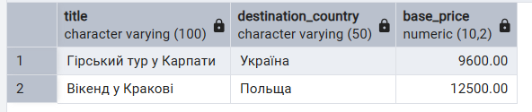
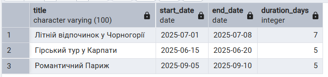
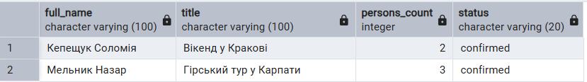
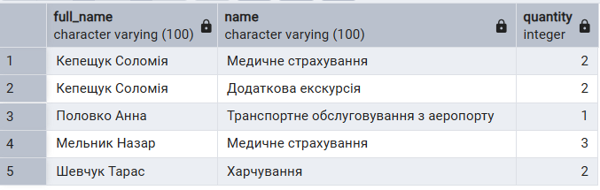
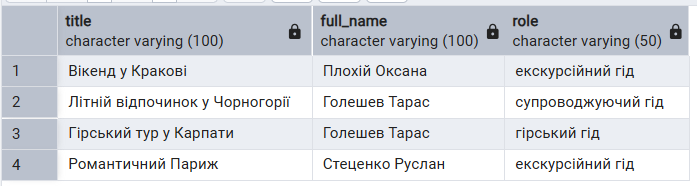
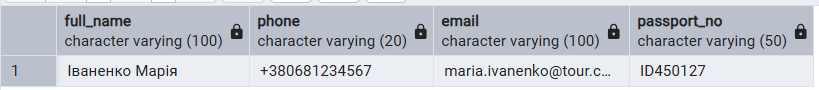
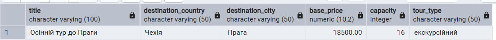
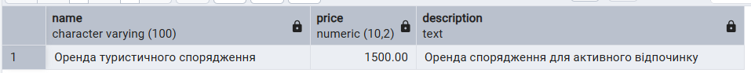

# Лабораторна робота №3
## Виконала: Кепещук Соломія ІО-41

---

## Тема:
Маніпулювання даними SQL (OLTP)
## Мета роботи:
- Написати запити SELECT для отримання даних (включаючи фільтрацію за допомогою WHERE та вибір певних стовпців).
- Практикувати використання операторів INSERT для додавання нових рядків до таблиць.
- Практикувати використання оператора UPDATE для зміни існуючих рядків (використовуючи SET та WHERE).
- Практикувати використання операторів DELETE для безпечного видалення рядків (за допомогою WHERE).
- Вивчити основні операції маніпулювання даними (DML) у PostgreSQL та спостерігати за їхнім впливом.

## SELECT
### 1. Пошук доступних турів до 20000 грн
Мета: знайти туристичні пропозиції, вартість яких менша за 20000 грн.

Очікуваний результат: буде виведено доступніші тури та відсортовані за зростанням ціни.
```sql
-- Виводимо доступні тури, вартість яких менша за 20000 грн
SELECT title, destination_country, base_price
FROM Tour
WHERE base_price < 20000
ORDER BY base_price;
```
Результат:
<p align="center">
  <br>
  <i>Рисунок 1 – Пошук доступних за ціною турів</i>
</p>

### 2. Пошук турів, які тривають більше 4 днів
Мета: визначити тури, які тривають більше 4 днів.

Очікуваний результат: буде показано тури з датами початку й завершення та тривалістю подорожі.
```sql
-- Виводимо тури, тривалість яких більша за 4 дні
SELECT title, start_date, end_date, end_date - start_date AS duration_days
FROM Tour
WHERE end_date - start_date > 4;
```
Результат:
<p align="center">
  <br>
  <i>Рисунок 2 – Пошук турів за тривалістю подорожі</i>
</p>

### 3. Перегляд підтверджених бронювань
Мета: переглянути бронювання, які вже мають статус confirmed.

Очікуваний результат: буде виведено тільки підтверджені бронювання.
```sql
-- Виводимо бронювання, які вже підтверджені
SELECT booking_id, customer_id, tour_id, status
FROM Booking
WHERE status = 'confirmed';
```
Результат:
<p align="center">
  <br>
  <i>Рисунок 3 – Перегляд підтверджених бронювань</i>
</p>

### 4. Пошук клієнтів, які замовили додаткові послуги
Мета: переглянути, які клієнти замовили додаткові послуги до своїх турів.

Очікуваний результат: буде показано клієнта, назву туру, додаткову послугу та її кількість.
```sql
-- Виводимо клієнтів, які мають додаткові послуги у бронюванні
SELECT c.full_name, s.name, bs.quantity
FROM BookingService bs
JOIN Booking b ON bs.booking_id = b.booking_id
JOIN Customer c ON b.customer_id = c.customer_id
JOIN Service s ON bs.service_id = s.service_id;
```
Результат:
<p align="center">
  <br>
  <i>Рисунок 4 – Перегляд клієнтів із додатковими послугами</i>
</p>

### 5. Перегляд турів із закріпленими гідами
Мета: переглянути, які гіди закріплені за кожним туром.

Очікуваний результат: буде виведено назви турів, імена гідів та їхні ролі.
```sql
-- Виводимо тури разом із закріпленими гідами
SELECT t.title, g.full_name, tg.role
FROM TourGuide tg
JOIN Tour t ON tg.tour_id = t.tour_id
JOIN Guide g ON tg.guide_id = g.guide_id;
```
Результат:
<p align="center">
  <br>
  <i>Рисунок 5 – Перегляд турів із закріпленими гідами</i>
</p>

---

## INSERT
### 1. Додавання нового клієнта
Мета: додати нового клієнта до таблиці Customer.

Очікуваний результат: у таблиці Customer з’явиться новий запис з даними клієнта Іваненко Марії.
```sql
-- Додаємо нового клієнта до таблиці Customer
INSERT INTO Customer (full_name, phone, email, passport_no)
VALUES ('Іваненко Марія', '+380681234567', 'maria.ivanenko@tour.com', 'ID450127');

-- Перевіряємо додавання клієнта
SELECT full_name, phone, email, passport_no
FROM Customer
WHERE email = 'maria.ivanenko@tour.com';
```
Результат:
<p align="center">
  <br>
  <i>Рисунок 6 – Додавання нового клієнта</i>
</p>

### 2. Додавання нового туру
Мета: додати новий туристичний тур до таблиці Tour.

Очікуваний результат: у таблиці Tour з’явиться новий запис про тур до Праги.
```sql
-- Додаємо новий тур до таблиці Tour
INSERT INTO Tour (title, destination_country, destination_city, start_date, end_date, base_price, capacity, tour_type)
VALUES ('Осінній тур до Праги', 'Чехія', 'Прага', '2025-10-10', '2025-10-15', 18500.00, 16, 'екскурсійний');

-- Перевіряємо додавання туру
SELECT title, destination_country, destination_city, base_price, capacity, tour_type
FROM Tour
WHERE title = 'Осінній тур до Праги';
```
Результат:
<p align="center">
  <br>
  <i>Рисунок 7 – Додавання нового туру</i>
</p>

### 3. Додавання нової додаткової послуги
Мета: додати нову додаткову послугу до таблиці Service.

Очікуваний результат: у таблиці Service з’явиться новий запис про оренду туристичного спорядження.
```sql
-- Додаємо нову додаткову послугу до таблиці Service
INSERT INTO Service (name, price, description)
VALUES ('Оренда туристичного спорядження', 1500.00, 'Оренда спорядження для активного відпочинку');

-- Перевіряємо додавання послуги
SELECT name, price, description
FROM Service
WHERE name = 'Оренда туристичного спорядження';
```
Результат:
<p align="center">
  <br>
  <i>Рисунок 8 – Додавання нової додаткової послуги</i>
</p>


