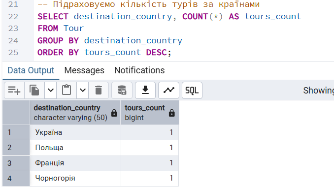
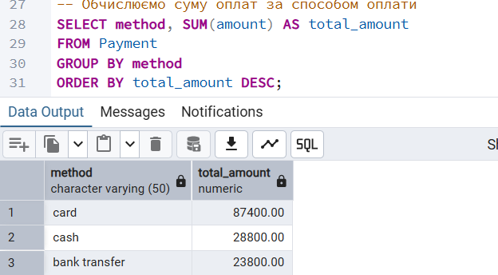
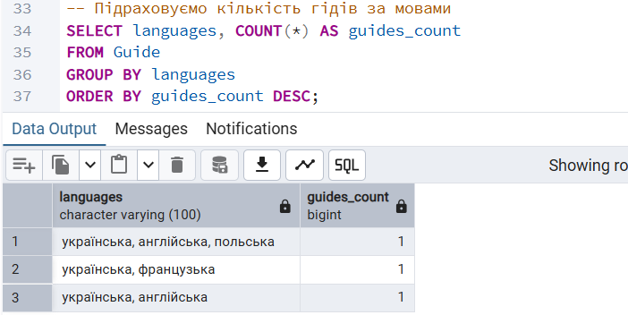
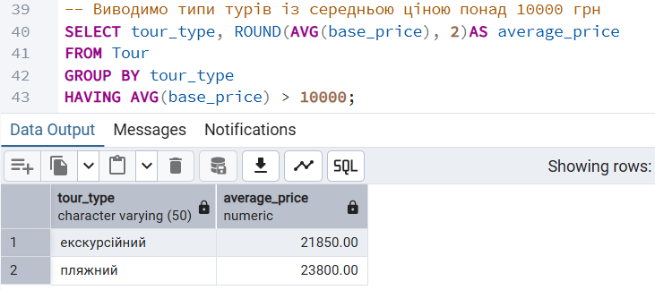
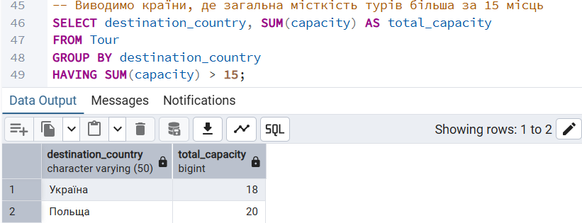
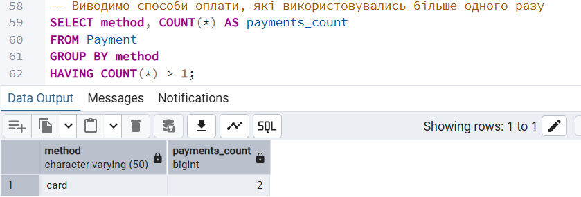
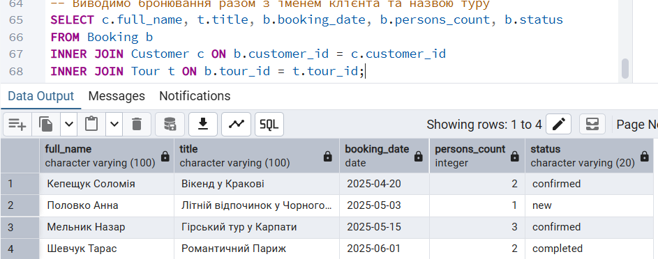
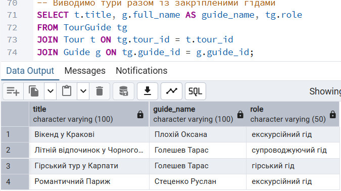
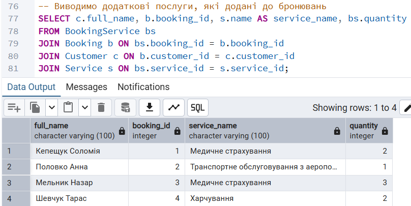
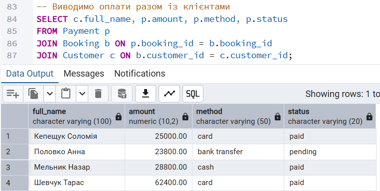

# Лабораторна робота №4
## Виконала: Кепещук Соломія ІО-41

---

## Тема:
Аналітичні SQL-запити (OLAP)
## Мета роботи:
- Використовувати агрегатні функції, такі як `COUNT`, `SUM`, `AVG`, `MIN` та `MAX`, для обчислення зведеної статистики з ваших даних.
- Написати запити `GROUP BY` для групування рядків за одним або кількома стовпцями та обчислення агрегатів для кожної групи.
- Використовувати `HAVING` для фільтрації результатів згрупованих запитів на основі агрегованих умов.
- Виконувати операції `JOIN` (принаймні `INNER JOIN` та `LEFT JOIN`), щоб об'єднати дані з кількох таблиць.
- Створювати об'єднані запити на агрегацію для кількох таблиць, які об'єднують таблиці та створюють згрупований, агрегований вивід.
- Інтерпретувати результати ваших запитів та пояснити, що робить кожен з них.

## Агрегатні функції 
### 1. Підрахунок загальної кількості клієнтів
Запит підраховує загальну кількість клієнтів, які збережені в таблиці Customer.
```sql
-- Підраховуємо загальну кількість клієнтів у базі даних
SELECT COUNT(*) AS total_customers
FROM Customer;
```
Результат:
<p align="center">
  <br>
  <i>Рисунок 1 – Загальна кількість клієнтів</i>
</p>

### 2. Обчислення середньої вартості туру
Запит використовується для обчислення середньої вартості туристичних пропозицій у таблиці `Tour`.
```sql
-- Обчислюємо середню вартість туру
SELECT ROUND(AVG(base_price), 2) AS average_tour_price
FROM Tour;
```
Результат:
<p align="center">
  <br>
  <i>Рисунок 2 – Середня вартість туру</i>
</p>

### 3. Обчислення загальної суми оплат
Запит використовує функцію `SUM`, щоб підрахувати загальну суму всіх оплат у таблиці `Payment`.
```sql
-- Обчислюємо загальну суму оплат
SELECT SUM(amount) AS total_payments
FROM Payment;
```
Результат:
<p align="center">
  <br>
  <i>Рисунок 3 – Загальна сума оплат</i>
</p>

### 4. Пошук мінімальної ціни туру
Запит знаходить найменшу вартість туру серед усіх туристичних пропозицій.
```sql
-- Знаходимо мінімальну ціну туру
SELECT MIN(base_price) AS min_price
FROM Tour;
```
Результат:
<p align="center">
  <br>
  <i>Рисунок 4 – Мінімальна ціна туру</i>
</p>

### 5. Пошук максимальної ціни туру
Запит знаходить найбільшу вартість туру серед усіх туристичних пропозицій.
```sql
-- Знаходимо максимальну ціну туру
SELECT MAX(base_price) AS max_price
FROM Tour;
```
Результат:
<p align="center">
  <br>
  <i>Рисунок 5 – Максимальна ціна туру</i>
</p>

--- 

## Групування даних
### 1. Кількість турів за країнами
Запит групує туристичні пропозиції за країною призначення та підраховує, скільки турів є для кожної країни.
```sql
-- Підраховуємо кількість турів за країнами
SELECT destination_country, COUNT(*) AS tours_count
FROM Tour
GROUP BY destination_country
ORDER BY tours_count DESC;
```
<p align="center">
  <br>
  <i>Рисунок 6 – Кількість турів за країнами</i>
</p>

### 2. Сума оплат за способом оплати
Запит групує платежі за способом оплати та обчислює загальну суму для кожного способу.
```sql
-- Обчислюємо суму оплат за способом оплати
SELECT method, SUM(amount) AS total_amount
FROM Payment
GROUP BY method
ORDER BY total_amount DESC;
```
Результат:
<p align="center">
  <br>
  <i>Рисунок 7 – Сума оплат за способом оплати</i>
</p>

### 3. Кількість гідів за мовами
Запит групує гідів за мовами, якими вони володіють, і підраховує кількість гідів у кожній групі.
```sql
-- Підраховуємо кількість гідів за мовами
SELECT languages, COUNT(*) AS guides_count
FROM Guide
GROUP BY languages
ORDER BY guides_count DESC;
```
<p align="center">
  <br>
  <i>Рисунок 8 – Кількість гідів за мовами</i>
</p>

---

## Фільтрування груп
### 1. Типи турів із середньою ціною понад 10000 грн
Запит групує тури за типом і залишає тільки ті типи, у яких середня ціна більша за 10000 грн.
```sql
-- Виводимо типи турів із середньою ціною понад 10000 грн
SELECT tour_type, ROUND(AVG(base_price), 2)AS average_price
FROM Tour
GROUP BY tour_type
HAVING AVG(base_price) > 10000;
```
Результат:
<p align="center">
  <br>
  <i>Рисунок 9 – Типи турів із середньою ціною понад 10000 грн</i>
</p>

### 2. Тури з місткістю більше 15 місць
Запит групує тури за країною призначення і показує тільки ті країни, де загальна місткість турів більша за 15 місць.
```sql
-- Виводимо країни, де загальна місткість турів більша за 15 місць
SELECT destination_country, SUM(capacity) AS total_capacity
FROM Tour
GROUP BY destination_country
HAVING SUM(capacity) > 15;
```
Результат:
<p align="center">
  <br>
  <i>Рисунок 10 – Країни із загальною місткістю турів більше 15 місць</i>
</p>

### 3. Способи оплати, які використовувались більше одного разу
Запит групує платежі за способом оплати і показує тільки ті способи, які зустрічаються більше одного разу.
```sql
-- Виводимо способи оплати, які використовувались більше одного разу
SELECT method, COUNT(*) AS payments_count
FROM Payment
GROUP BY method
HAVING COUNT(*) > 1;
```
Результат:
<p align="center">
  <br>
  <i>Рисунок 11 – Способи оплати, які використовувались більше одного разу</i>
</p>

---

## JOIN-запити
### 1. Бронювання з іменем клієнта та назвою туру
Запит використовує `INNER JOIN`, щоб об’єднати таблиці `Booking`, `Customer` і `Tour` та показати бронювання у зрозумілому вигляді.
```sql
-- Виводимо бронювання разом з іменем клієнта та назвою туру
SELECT c.full_name, t.title, b.booking_date, b.persons_count, b.status
FROM Booking b
INNER JOIN Customer c ON b.customer_id = c.customer_id
INNER JOIN Tour t ON b.tour_id = t.tour_id;
```
Результат:
<p align="center">
  <br>
  <i>Рисунок 12 – Бронювання з клієнтами та турами</i>
</p>

### 2. Тури із закріпленими гідами
Запит об’єднує таблиці `TourGuide`, `Tour` і `Guide`, щоб показати, який гід закріплений за кожним туром.
```sql
-- Виводимо тури разом із закріпленими гідами
SELECT t.title, g.full_name AS guide_name, tg.role
FROM TourGuide tg
JOIN Tour t ON tg.tour_id = t.tour_id
JOIN Guide g ON tg.guide_id = g.guide_id;
```
Результат:
<p align="center">
  <br>
  <i>Рисунок 13 – Тури із закріпленими гідами</i>
</p>

### 3. Додаткові послуги у бронюваннях
Запит об’єднує таблиці `BookingService`, `Booking`, `Customer` і `Service`, щоб показати, які додаткові послуги були додані до бронювань клієнтів.
```sql
-- Виводимо додаткові послуги, які додані до бронювань
SELECT c.full_name, b.booking_id, s.name AS service_name, bs.quantity
FROM BookingService bs
JOIN Booking b ON bs.booking_id = b.booking_id
JOIN Customer c ON b.customer_id = c.customer_id
JOIN Service s ON bs.service_id = s.service_id;
```
Результат:
<p align="center">
  <br>
  <i>Рисунок 14 – Додаткові послуги у бронюваннях</i>
</p>

### 4. Оплати клієнтів за бронюваннями
Запит об’єднує таблиці `Payment`, `Booking` і `Customer`, щоб показати, який клієнт здійснив оплату за бронювання.
```sql
-- Виводимо оплати разом із клієнтами
SELECT c.full_name, p.amount, p.method, p.status
FROM Payment p
JOIN Booking b ON p.booking_id = b.booking_id
JOIN Customer c ON b.customer_id = c.customer_id;
```
Результат:
<p align="center">
  <br>
  <i>Рисунок 15 – Оплати клієнтів за бронюваннями</i>
</p>

---
##
### 
### 
### 
---
##
### 
### 
### 
---
## Висновок
