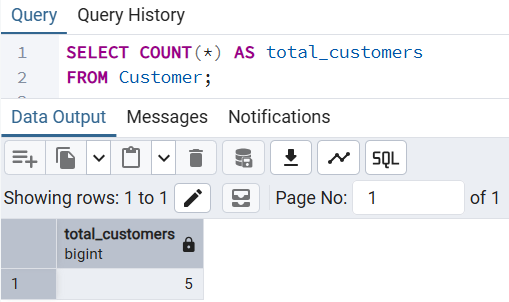
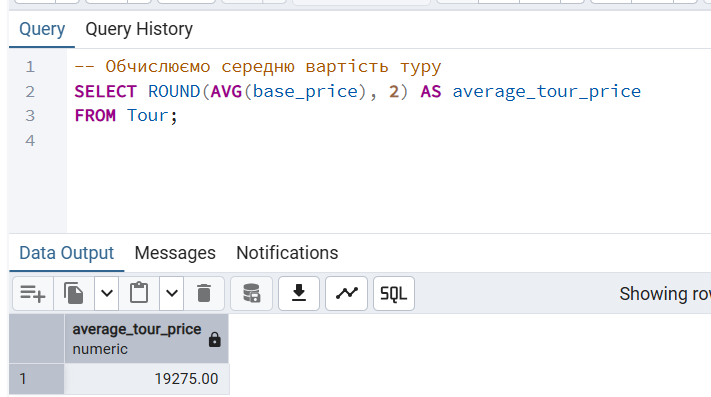
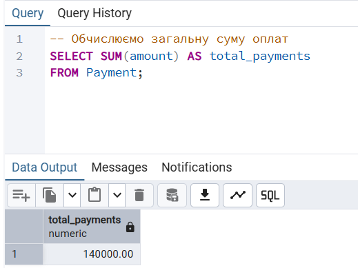
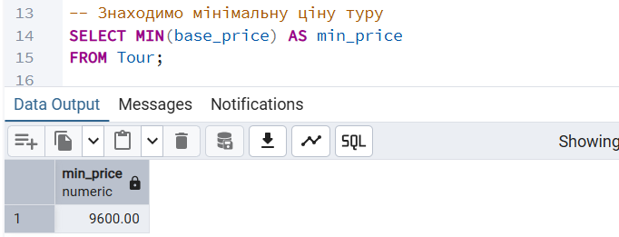
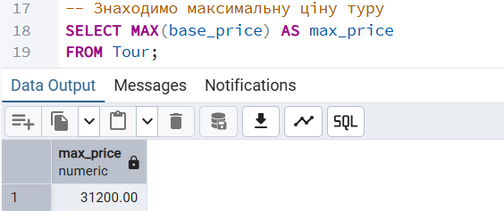

# Лабораторна робота №4
## Виконала: Кепещук Соломія ІО-41

---

## Тема:
Аналітичні SQL-запити (OLAP)
## Мета роботи:
- Використовувати агрегатні функції, такі як `COUNT`, `SUM`, `AVG`, `MIN` та `MAX`, для обчислення зведеної статистики з ваших даних.
- Написати запити `GROUP BY` для групування рядків за одним або кількома стовпцями та обчислення агрегатів для кожної групи.
- Використовувати `HAVING` для фільтрації результатів згрупованих запитів на основі агрегованих умов.
- Виконувати операції `JOIN` (принаймні `INNER JOIN` та `LEFT JOIN`), щоб об'єднати дані з кількох таблиць.
- Створювати об'єднані запити на агрегацію для кількох таблиць, які об'єднують таблиці та створюють згрупований, агрегований вивід.
- Інтерпретувати результати ваших запитів та пояснити, що робить кожен з них.

## Агрегатні функції 
### 1. Підрахунок загальної кількості клієнтів
Запит підраховує загальну кількість клієнтів, які збережені в таблиці Customer.
```sql
-- Підраховуємо загальну кількість клієнтів у базі даних
SELECT COUNT(*) AS total_customers
FROM Customer;
```
Результат:
<p align="center">
  <br>
  <i>Рисунок 1 – Загальна кількість клієнтів</i>
</p>

### 2. Обчислення середньої вартості туру
Запит використовується для обчислення середньої вартості туристичних пропозицій у таблиці `Tour`.
```sql
-- Обчислюємо середню вартість туру
SELECT ROUND(AVG(base_price), 2) AS average_tour_price
FROM Tour;
```
Результат:
<p align="center">
  <br>
  <i>Рисунок 2 – Середня вартість туру</i>
</p>

### 3. Обчислення загальної суми оплат
Запит використовує функцію `SUM`, щоб підрахувати загальну суму всіх оплат у таблиці `Payment`.
```sql
-- Обчислюємо загальну суму оплат
SELECT SUM(amount) AS total_payments
FROM Payment;
```
<p align="center">
  <br>
  <i>Рисунок 2 – Загальна сума оплат</i>
</p>

### 4. Пошук мінімальної ціни туру
Запит знаходить найменшу вартість туру серед усіх туристичних пропозицій.
```sql
-- Знаходимо мінімальну ціну туру
SELECT MIN(base_price) AS min_price
FROM Tour;
```
<p align="center">
  <br>
  <i>Рисунок 3 – Мінімальна ціна туру</i>
</p>

### 5. Пошук максимальної ціни туру
Запит знаходить найбільшу вартість туру серед усіх туристичних пропозицій.
```sql
-- Знаходимо максимальну ціну туру
SELECT MAX(base_price) AS max_price
FROM Tour;
```
<p align="center">
  <br>
  <i>Рисунок 4 – Максимальна ціна туру</i>
</p>
--- 
## 
---
##
---
##
