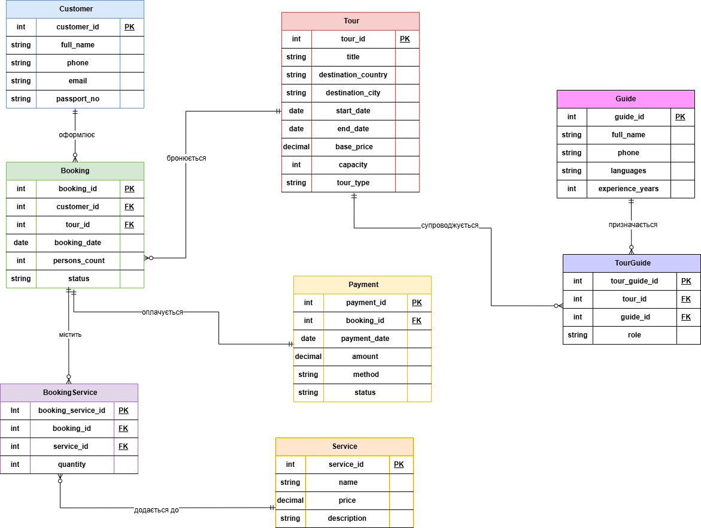
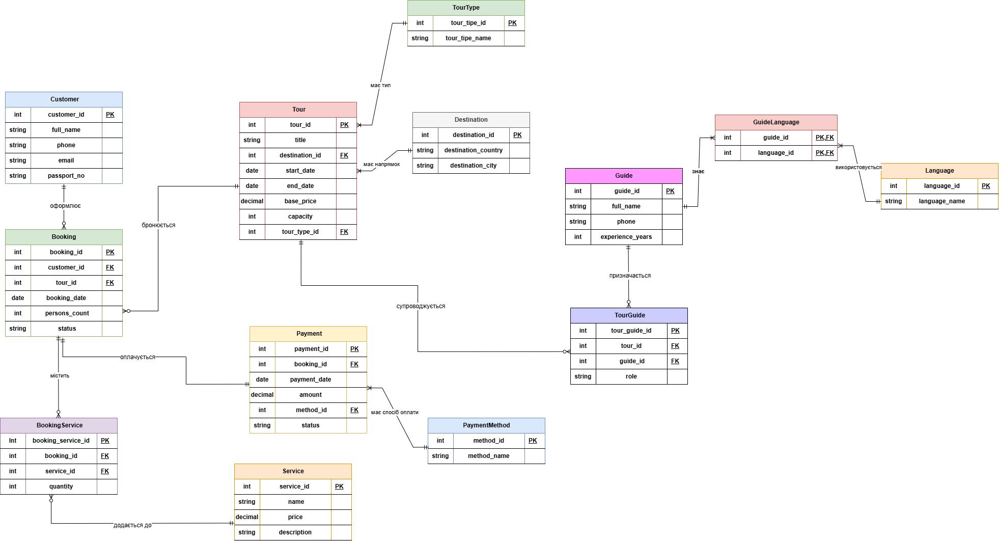

# Нормалізація бази даних туристичної агенції

## 1. Аналіз початкової схеми

<p align="center">
  <br>
  <i>Рисунок 1 – Початкова ER-діаграма бази даних туристичної агенції</i>
</p>

Початкова база даних містить таблиці `Customer`, `Tour`, `Booking`, `Payment`, `Service`, `BookingService`, `Guide` та `TourGuide`. Під час аналізу схеми було визначено таблиці, у яких можуть виникати надлишковість даних та аномалії оновлення. Для подальшої нормалізації було обрано таблиці `Tour`, `Guide` та `Payment`.

## 2. Виявлення надлишковості та аномалій

У таблиці `Tour` зберігається інформація про тури. Проблема полягає в тому, що поля `destination_country`, `destination_city` та `tour_type` є текстовими і можуть повторюватися в багатьох записах. Наприклад, якщо декілька турів проводяться в одній країні або одному місті, ці значення будуть дублюватися в кожному рядку.

Таке зберігання даних створює надлишковість. Крім того, може виникнути аномалія оновлення: якщо потрібно змінити назву країни, міста або типу туру, доведеться редагувати багато записів. Також можливі різні варіанти написання однакових значень, наприклад `Italy` і `Italia`.

У таблиці `Guide` проблемним є поле `languages`. Воно може містити кілька мов в одному полі, наприклад `English, German, Polish`. Це порушує вимогу атомарності, оскільки в одній клітинці зберігається не одне значення, а список значень. Через це складніше виконувати пошук гідів за конкретною мовою та підтримувати однаковий формат запису.

У таблиці `Payment` проблемним є поле `method`, у якому спосіб оплати зберігається як текстове значення, наприклад `card`, `cash` або `transfer`. Однакові способи оплати можуть повторюватися в багатьох платежах. Якщо такі значення вводити вручну, можуть з’явитися різні варіанти одного способу оплати, наприклад `card`, `Card` або `credit card`. Це ускладнює фільтрацію, групування та аналіз оплат.

## 3. Функціональні залежності
Для проблемних таблиць було визначено функціональні залежності.

У таблиці `Tour` первинним ключем є `tour_id`, тому цей атрибут визначає всі інші дані про конкретний тур:
```text
tour_id -> title, destination_country, destination_city, start_date, end_date, base_price, capacity, tour_type
```

У таблиці `Guide` первинним ключем є `guide_id`:
```text
guide_id -> full_name, phone, languages, experience_years
```

У таблиці `Payment` первинним ключем є `payment_id`:
```text
payment_id -> booking_id, payment_date, amount, method, status
```

## 4. Перевірка нормальних форм початкової схеми

**1NF.** У першій нормальній формі кожне поле таблиці має містити тільки одне значення. У нашій схемі проблема є в таблиці `Guide`, тому що поле `languages` може зберігати кілька мов одного гіда. Через це мови краще винести в окрему таблицю.

**2NF.** У другій нормальній формі всі неключові поля мають залежати від усього первинного ключа. У більшості таблиць ключ складається з одного поля, тому часткових залежностей немає. У таблицях `BookingService` і `TourGuide` ключ складається з двох полів, але дані залежать від обох полів, тому 2NF не порушується.

**3NF.** У третій нормальній формі не повинно бути зайвого повторення даних. У початковій схемі можуть повторюватися напрямки турів, типи турів і способи оплати. Це може створювати помилки при зміні даних, тому такі значення потрібно винести в окремі таблиці.

Отже, початкова схема потребує нормалізації до 3NF. Для цього потрібно створити окремі таблиці для напрямків турів, типів турів, мов гідів і способів оплати.

## 5. Покрокова нормалізація

### Перехід до 1NF

На цьому етапі поле `languages` у таблиці `Guide` було винесено в окремі таблиці.

Було:
```text
Guide(guide_id, full_name, phone, languages, experience_years)
```

Стало:
```text
Guide(guide_id, full_name, phone, experience_years)
Language(language_id, language_name)
GuideLanguage(guide_id, language_id)
```

У результаті мови не зберігаються одним списком у таблиці `Guide`. Кожна мова записується окремо, а таблиця `GuideLanguage` показує, які мови знає кожен гід.

### Перехід до 2NF

У більшості таблиць ключ складається з одного поля, тому часткових залежностей немає. У таблицях `BookingService` і `TourGuide` ключ складається з двох полів, але дані залежать від обох полів.

У результаті порушень 2NF не виявлено, тому додатково змінювати таблиці для цього етапу не потрібно.

### Перехід до 3NF

На цьому етапі повторювані дані з таблиць `Tour` і `Payment` було винесено в окремі таблиці.

Було:
```text
Tour(tour_id, title, destination_country, destination_city, start_date, end_date, base_price, capacity, tour_type)
```

Стало:
```text
Destination(destination_id, destination_country, destination_city)
TourType(tour_type_id, tour_type_name)
Tour(tour_id, title, destination_id, start_date, end_date, base_price, capacity, tour_type_id)
```

У результаті країна, місто і тип туру більше не дублюються в таблиці `Tour`. Вони зберігаються окремо, а в `Tour` залишаються тільки посилання на них.

Було:
```text
Payment(payment_id, booking_id, payment_date, amount, method, status)
```

Стало:
```text
PaymentMethod(method_id, method_name)
Payment(payment_id, booking_id, payment_date, amount, method_id, status)
```

У результаті спосіб оплати більше не записується текстом у кожному платежі. Він зберігається окремо в таблиці `PaymentMethod`.

Після нормалізації повторювані дані винесені в окремі таблиці, тому структура бази стала зрозумілішою і зручнішою для оновлення.

## 6. SQL DDL-скрипти для змінених таблиць
```sql
-- ==========================================
-- 1. ТРАНСФОРМАЦІЯ ТАБЛИЦІ TOUR
-- ==========================================

CREATE TABLE IF NOT EXISTS Destination (
    destination_id SERIAL PRIMARY KEY,
    destination_country VARCHAR(50) NOT NULL,
    destination_city VARCHAR(50) NOT NULL,
    UNIQUE (destination_country, destination_city)
);

CREATE TABLE IF NOT EXISTS TourType (
    tour_type_id SERIAL PRIMARY KEY,
    tour_type_name VARCHAR(50) NOT NULL UNIQUE
);

ALTER TABLE Tour ADD COLUMN destination_id INT;
ALTER TABLE Tour ADD COLUMN tour_type_id INT;

ALTER TABLE Tour
    ADD CONSTRAINT fk_tour_destination
    FOREIGN KEY (destination_id) REFERENCES Destination(destination_id);

ALTER TABLE Tour
    ADD CONSTRAINT fk_tour_type
    FOREIGN KEY (tour_type_id) REFERENCES TourType(tour_type_id);

ALTER TABLE Tour DROP COLUMN destination_country;
ALTER TABLE Tour DROP COLUMN destination_city;
ALTER TABLE Tour DROP COLUMN tour_type;


-- ==========================================
-- 2. ТРАНСФОРМАЦІЯ ТАБЛИЦІ GUIDE
-- ==========================================

CREATE TABLE IF NOT EXISTS Language (
    language_id SERIAL PRIMARY KEY,
    language_name VARCHAR(50) NOT NULL UNIQUE
);

CREATE TABLE IF NOT EXISTS GuideLanguage (
    guide_id INT NOT NULL,
    language_id INT NOT NULL,
    PRIMARY KEY (guide_id, language_id),
    FOREIGN KEY (guide_id) REFERENCES Guide(guide_id),
    FOREIGN KEY (language_id) REFERENCES Language(language_id)
);

ALTER TABLE Guide DROP COLUMN languages;


-- ==========================================
-- 3. ТРАНСФОРМАЦІЯ ТАБЛИЦІ PAYMENT
-- ==========================================

CREATE TABLE IF NOT EXISTS PaymentMethod (
    method_id SERIAL PRIMARY KEY,
    method_name VARCHAR(30) NOT NULL UNIQUE
);

ALTER TABLE Payment ADD COLUMN method_id INT;

ALTER TABLE Payment
    ADD CONSTRAINT fk_payment_method
    FOREIGN KEY (method_id) REFERENCES PaymentMethod(method_id);

ALTER TABLE Payment DROP COLUMN method;
```

## 7. Результат нормалізації
<p align="center">
  <br>
  <i>Рисунок 2 – Оновлена нормалізована ER-діаграма бази даних туристичної агенції</i>
</p>
