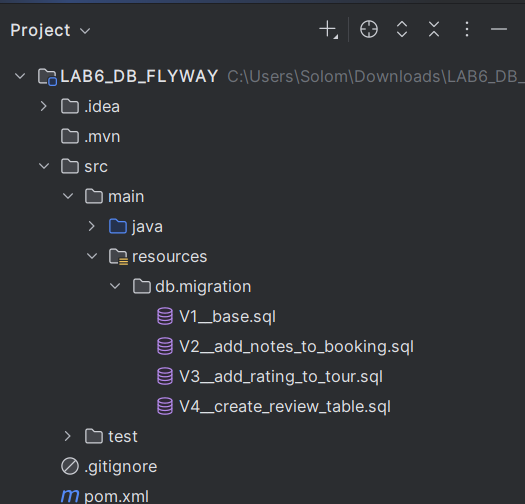
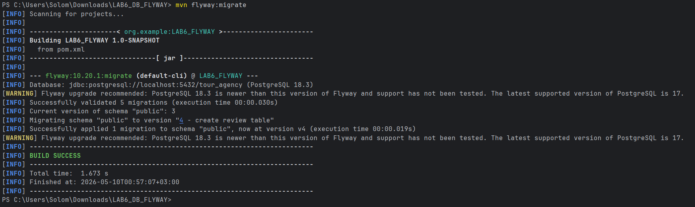

# Лабораторна робота №6
## Виконала: Кепещук Соломія ІО-41

---

## Тема:
Міграції схем за допомогою Flyway.
## Мета роботи:
- Використати Flyway для керування схемами та дослідити, як Flyway може аналізувати та змінювати схему бази даних.
- Зрозуміти конвенцію іменування Flyway-скриптів, застосування міграцій, генерування та застосування змін схеми.
- Написати кілька версійних SQL-міграцій для своєї схеми та застосувати їх через Flyway.
- Перевірити результати змін за допомогою SQL-запитів і задокументувати їх.
- Навчитися коректно використовувати контролювання версій міграцій у Git.

---

## Виконанння завдання :
Для виконання лабораторної роботи було створено новий Maven-проєкт. У ньому було налаштовано підключення до бази даних PostgreSQL `tour_agency`, яка була створена у попередніх лабораторних роботах.

Міграційні SQL-скрипти були розміщені у папці:

<p align="center">
  <br>
  <i>Рисунок 1 – Структура папки з міграційними скриптами</i>
</p>

### Налаштування Flyway
Для роботи з міграціями у проєкті було налаштовано Flyway через файл `pom.xml`. У цьому файлі були додані залежності для підключення до PostgreSQL та для роботи з Flyway. Також було підключено Maven-плагін `flyway-maven-plugin`, за допомогою якого виконуються міграції бази даних.
У налаштуваннях плагіна було вказано підключення до локальної бази даних `tour_agency`. Також було задано користувача PostgreSQL, пароль для підключення та шлях до папки, у якій зберігаються міграційні SQL-скрипти. 

Оскільки база даних була створена ще до підключення Flyway, у налаштуваннях використано параметр `baselineOnMigrate`. Він дозволяє Flyway працювати з уже існуючою схемою бази даних і застосовувати до неї нові міграції.

Повний вміст файлу `pom.xml`:

```xml
<?xml version="1.0" encoding="UTF-8"?>

<project xmlns="http://maven.apache.org/POM/4.0.0"
         xmlns:xsi="http://www.w3.org/2001/XMLSchema-instance"
         xsi:schemaLocation="http://maven.apache.org/POM/4.0.0 https://maven.apache.org/xsd/maven-4.0.0.xsd">

    <modelVersion>4.0.0</modelVersion>

    <groupId>org.example</groupId>
    <artifactId>LAB6_FLYWAY</artifactId>
    <version>1.0-SNAPSHOT</version>

    <properties>
        <maven.compiler.source>17</maven.compiler.source>
        <maven.compiler.target>17</maven.compiler.target>
        <project.build.sourceEncoding>UTF-8</project.build.sourceEncoding>
    </properties>

    <dependencies>
        <dependency>
            <groupId>org.postgresql</groupId>
            <artifactId>postgresql</artifactId>
            <version>42.7.4</version>
        </dependency>

        <dependency>
            <groupId>org.flywaydb</groupId>
            <artifactId>flyway-core</artifactId>
            <version>10.20.1</version>
        </dependency>

        <dependency>
            <groupId>org.flywaydb</groupId>
            <artifactId>flyway-database-postgresql</artifactId>
            <version>10.20.1</version>
        </dependency>
    </dependencies>

    <build>
        <plugins>
            <plugin>
                <groupId>org.flywaydb</groupId>
                <artifactId>flyway-maven-plugin</artifactId>
                <version>10.20.1</version>
                <configuration>
                    <url>jdbc:postgresql://localhost:5432/tour_agency</url>
                    <user>postgres</user>
                    <password>1234</password>
                    <baselineOnMigrate>true</baselineOnMigrate>
                    <locations>
                        <location>filesystem:src/main/resources/db/migration</location>
                    </locations>
                </configuration>
            </plugin>
        </plugins>
    </build>

</project>
```

### Міграційні скрипти
Для зміни схеми бази даних було створено кілька міграційних SQL-скриптів.

У роботі були створені такі міграційні файли:

- V1__base.sql

Файл V1__base.sql використовується як базова версія схеми. Оскільки база даних туристичної агенції вже була створена у попередніх лабораторних роботах, цей файл позначає початковий стан схеми перед подальшими змінами.
```sql
-- Початкова схема бази даних туристичної агенції.
```

- V2__add_notes_to_booking.sql

У файлі V2__add_notes_to_booking.sql до таблиці booking було додано новий стовпець notes. Він може використовуватися для збереження додаткових приміток до бронювання.
```sql
ALTER TABLE booking
    ADD COLUMN notes TEXT;
```

- V3__add_rating_to_tour.sql

У файлі V3__add_rating_to_tour.sql до таблиці tour було додано стовпець rating. Це поле призначене для збереження оцінки туру.
```sql
ALTER TABLE tour
    ADD COLUMN rating NUMERIC(2,1);
```

- V4__create_review_table.sql

У файлі V4__create_review_table.sql було створено нову таблицю review. Вона призначена для збереження відгуків клієнтів про тури. У таблиці зберігаються ідентифікатор відгуку, клієнт, тур, оцінка, коментар і дата відгуку. Для зв’язку з таблицями customer і tour використано зовнішні ключі.
```sql
CREATE TABLE review (
    review_id SERIAL PRIMARY KEY,
    customer_id INT NOT NULL,
    tour_id INT NOT NULL,
    rating INT NOT NULL CHECK (rating BETWEEN 1 AND 5),
    comment TEXT,
    review_date DATE DEFAULT CURRENT_DATE,

    CONSTRAINT fk_review_customer FOREIGN KEY (customer_id)
        REFERENCES customer(customer_id),

    CONSTRAINT fk_review_tour FOREIGN KEY (tour_id)
        REFERENCES tour(tour_id)
);
```

### Запуск міграцій
Після створення всіх міграційних SQL-скриптів було виконано запуск Flyway через термінал IntelliJ IDEA. Для застосування міграцій до бази даних була використана команда:

```bash
mvn flyway:migrate
```
Після запуску команди Flyway підключився до бази даних `tour_agency` і перевірив наявні міграції. Оскільки схема бази вже існувала, Flyway зафіксував її початковий стан у таблиці `flyway_schema_history`. Далі були застосовані нові міграції, які внесли зміни до структури бази даних.

У результаті виконання команди в терміналі з’явилося повідомлення `BUILD SUCCESS`, що підтверджує успішне виконання міграцій.

<p align="center">
  <br>
  <i>Рисунок 4 – Успішне виконання команди mvn flyway:migrate</i>
</p>

## Результати запитів 

---

## Висновок 
